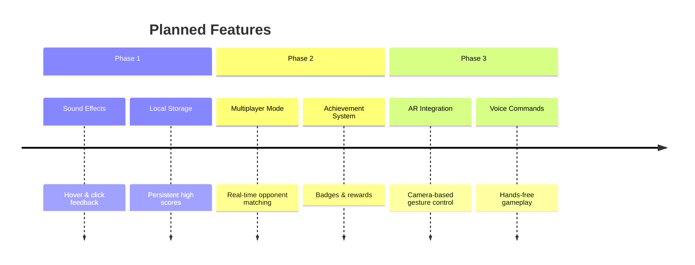

# 🎮 Snake Water Gun - Futuristic Game


A cutting-edge browser-based implementation of the classic "Snake Water Gun" game with futuristic UI elements and responsive design. Experience this timeless game reimagined for the modern web era.

## 🌐 Live Demo

**[Play Now](https://likitharavi25.github.io/game/)**

## 🚀 Features

- **Futuristic UI Design** - Sleek, modern interface with smooth animations  
- **Responsive Layout** - Optimized for desktop, tablet, and mobile devices  
- **Real-time Gameplay** - Instant feedback with visual and textual results  
- **Score Tracking** - Persistent score tracking during your session  
- **Minimalist Design** - Clean, distraction-free gaming experience  
- **Progressive Web App Ready** - Can be installed on most devices  

## 🎯 How to Play

Snake Water Gun is a hand game similar to Rock Paper Scissors with the following rules:

- 🐍 **Snake** beats 💧 **Water** (Snake drinks Water)  
- 💧 **Water** beats 🔫 **Gun** (Water rusts Gun)  
- 🔫 **Gun** beats 🐍 **Snake** (Gun shoots Snake)  

Select your weapon and try to outsmart the computer opponent!

## 🏗️ Architecture

```mermaid
graph TB
    A[User Interface] --> B[Event Handler]
    B --> C[Game Logic]
    C --> D[Random Computer Choice]
    C --> E[Result Calculation]
    E --> F[Score Update]
    E --> G[UI Feedback]
    F --> A
    G --> A
````

## 🧩 Technical Implementation

```mermaid
flowchart TD
    Start[Game Start] --> Wait[Wait for User Input]
    Wait -->|User Selection| Process[Process Game Logic]
    Process --> Generate[Generate Computer Choice]
    Process --> Compare[Compare Choices]
    Compare -->|Win| UpdateWin[Update User Score]
    Compare -->|Lose| UpdateLose[Update Computer Score]
    Compare -->|Draw| NoUpdate[No Score Change]
    UpdateWin --> Display[Display Result]
    UpdateLose --> Display
    NoUpdate --> Display
    Display --> Wait
```

## 📊 Game Logic Matrix

| User \ Computer | 🐍 Snake | 💧 Water | 🔫 Gun |
| --------------- | -------- | -------- | ------ |
| **🐍 Snake**    | Draw     | Win      | Lose   |
| **💧 Water**    | Lose     | Draw     | Win    |
| **🔫 Gun**      | Win      | Lose     | Draw   |

## 🛠️ Technology Stack

* **Frontend**: HTML5, CSS3, JavaScript (ES6+)
* **Styling**: Pure CSS with Flexbox
* **Graphics**: PNG assets with CSS enhancements
* **Hosting**: GitHub Pages
* **Version Control**: Git with GitHub

## 📱 Browser Support

| Browser         | Version | Support |
| --------------- | ------- | ------- |
| Chrome          | 60+     | ✅ Full  |
| Firefox         | 55+     | ✅ Full  |
| Safari          | 12+     | ✅ Full  |
| Edge            | 79+     | ✅ Full  |
| Mobile Browsers | Recent  | ✅ Full  |

## 🔧 Installation

No installation required! Simply visit [https://likitharavi25.github.io/game/](https://likitharavi25.github.io/game/) to start playing.

For local development:

```bash
git clone https://github.com/likitharavi25/game.git
cd game
# Open index.html in your browser
```

## 🎨 Customization

The game is designed with easy customization in mind:

* Modify colors in the CSS `:root` variables
* Replace image assets while maintaining the same filenames
* Adjust animation timing in the transition properties
* Extend game logic in the JavaScript section

## 🤝 Contributing

Contributions are welcome! Feel free to:

1. Fork the repository
2. Create a feature branch (`git checkout -b feature/amazing-feature`)
3. Commit your changes (`git commit -m 'Add amazing feature'`)
4. Push to the branch (`git push origin feature/amazing-feature`)
5. Open a Pull Request

## 📄 License

This project is open source and available under the [MIT License](LICENSE).

## 🌟 Future Enhancements



## 📞 Support

If you have any questions or suggestions, please open an issue on GitHub or contact the maintainer.

---

<div align="center">

**Enjoy the game!** 🎮

[](https://likitharavi25.github.io/game/)

</div>
